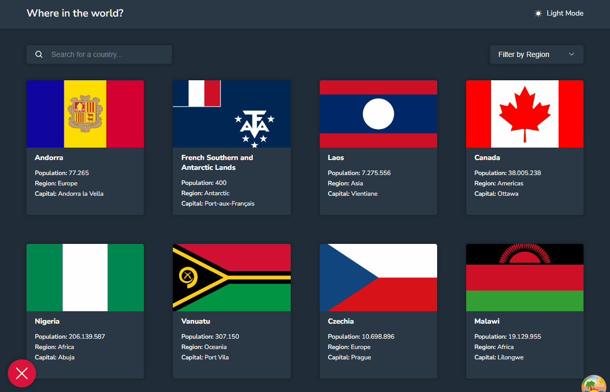

# Countries App

Countries App is a web application developed with React, TypeScript, Sass, and React Query, designed to provide users with a seamless experience of exploring and learning about countries around the world. The application fetches data from a RESTful API, allowing users to view a list of countries and access detailed information for each country.

## :runner: :computer: Running in your pc

```bash
  # Clone the project
  git clone https://github.com/igordev96/countries-app.git

  # Open it
  cd countries-app

  # Install the dependencies
  npm install

  # Run it
  npm run dev

  # Open it in your browser
  # If it's not the URL below, you can check your prompt
  # To see if Vite hosted on another PORT
  http://localhost:5173/
```

## :camera: Overview



## :cloud: See also the deployed application

https://countries-app-igordev96.netlify.app/

## :hammer: Techs used in this project

- ⚛️ **React**
- ⚛️ **React Router DOM**
- ⚛️ **TypeScript**
- ⚛️ **Phosphor Icons**
- ⚛️ **Radix-UI**
- ⚛️ **React Query**
- ⚛️ **SASS**
- ⚛️ **Vite**

---

Made by [Igor Alves](https://www.linkedin.com/in/igordev96)
